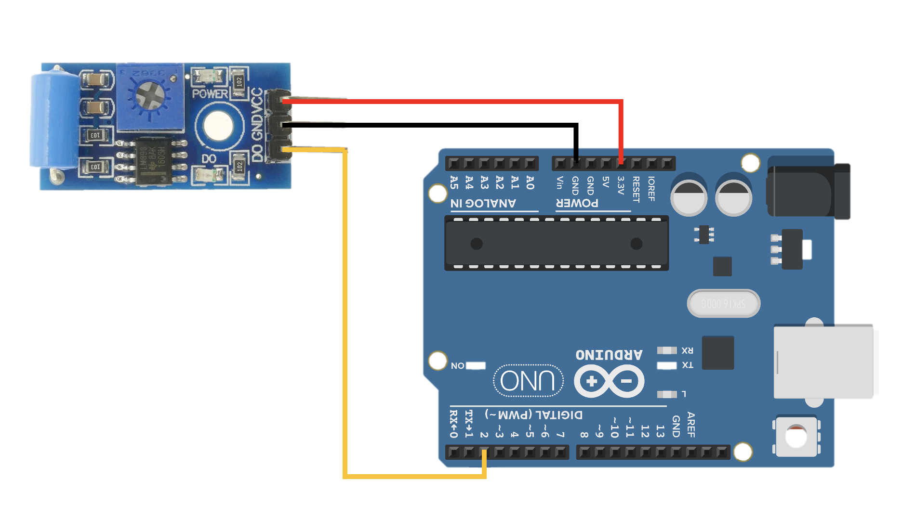
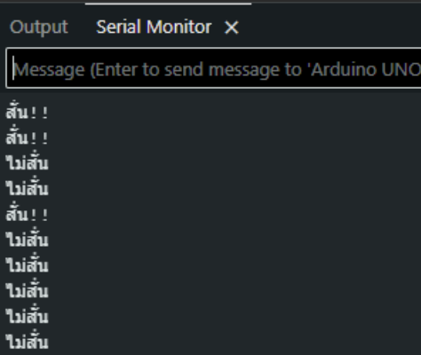

# Arduino Vibration Sensor (SW-420)

## Overview (ภาพรวม)
แลปนี้เป็นการทดลองการใช้ <font color="#E63946">**Vibration Sensor (เซ็นเซอร์ตรวจจับการสั่น)** </font>เพื่ออ่านค่าสถานะการสั่นแบบดิจิทัล (Digital Read) เมื่อเซ็นเซอร์ตรวจพบแรงสั่นสะเทือน บอร์ดจะแสดงผลลัพธ์การทำงานผ่านทาง Serial Monitor ทันที แลปนี้เหมาะสำหรับเป็นพื้นฐานในการนำไปประยุกต์ใช้กับระบบสัญญาณกันขโมย หรือระบบตรวจจับการสั่นของเครื่องจักร

## Hardware Wiring (การต่อวงจร)
การเชื่อมต่อสายสัญญาณระหว่างโมดูล Vibration Sensor และบอร์ด Arduino สามารถต่อได้ดังตารางด้านล่าง:

| Vibration Sensor | Arduino Board |
| :--- | :--- |
| **VCC** | 5V (หรือ 3.3V) |
| **GND** | GND |
| **D0** (Digital Output) | **D2** (Digital Pin 2) |



## Code
อัปโหลดโค้ดด้านล่างนี้ลงในบอร์ด Arduino ของคุณ (ตั้งค่า Baud Rate ใน Serial Monitor ที่ `9600`):

```cpp
int vibPin = 2; // D0 from module to D2 from board

void setup() {
  Serial.begin(9600);
  pinMode(vibPin, INPUT);
}

void loop() {
  int val = digitalRead(vibPin);
  
  if (val == 0) {
    Serial.println("ไม่สั่น");
  } else {
    Serial.println("สั่น!!"); 
  }
  
  delay(100);
}
```

Output:

