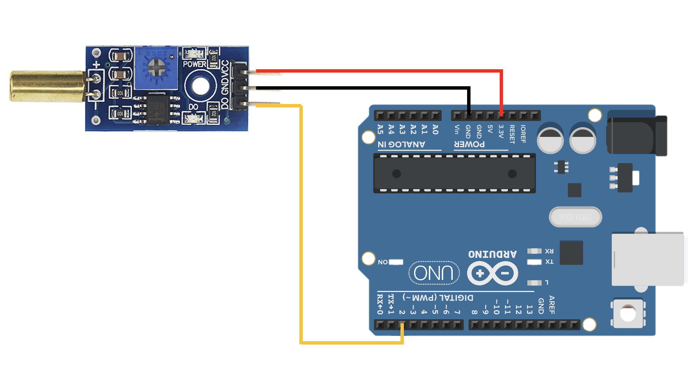
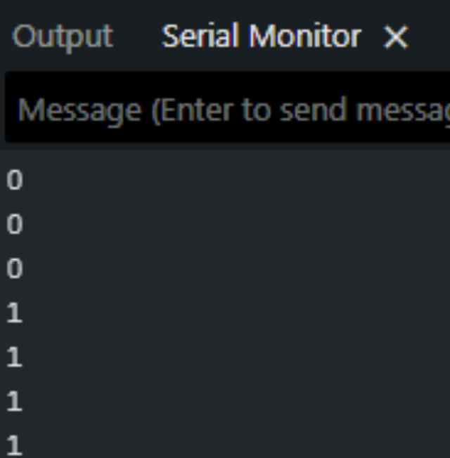

# Arduino Tilt Sensor (SW-520D)

## Overview (ภาพรวม)
แลปนี้เป็นการทดลองใช้งาน <font color="#E63946">**Tilt Sensor (เซ็นเซอร์วัดการเอียง)**</font>เซ็นเซอร์ตัวนี้ทำงานคล้ายกับสวิตช์ที่จะเปิด/ปิดวงจรตามองศาการเอียงของตัวเซ็นเซอร์ (มักใช้ปรอทหรือลูกกลิ้งโลหะด้านใน) 

ในแลปนี้ บอร์ด Arduino จะอ่านค่าดิจิทัล (Digital Read) จากเซ็นเซอร์ และแสดงผลลัพธ์ออกทาง Serial Monitor เป็นค่า `0` (LOW) หรือ `1` (HIGH) ขึ้นอยู่กับตำแหน่งการเอียงของโมดูล เหมาะสำหรับนำไปประยุกต์ใช้กับระบบตรวจจับการล้ม, การเอียงของหุ่นยนต์ หรือหน้าจออัจฉริยะ

## Hardware Wiring (การต่อวงจร)
การเชื่อมต่อสายสัญญาณระหว่างโมดูล Tilt Sensor และบอร์ด Arduino UNO สามารถทำได้ตามตารางนี้:

| Tilt Sensor Module | Arduino UNO Board |
| :--- | :--- |
| **VCC** | 5V (หรือ 3.3V) |
| **GND** | GND |
| **D0** (Digital Output) | **D2** (Digital Pin 2) |



## Code
อัปโหลดโค้ดด้านล่างนี้ลงในบอร์ด Arduino ของคุณ (ตรวจสอบให้แน่ใจว่าตั้งค่า Baud Rate ใน Serial Monitor เป็น `9600`):

```cpp
int tiltPin = 2; // D0 from module to D2 from board

void setup() {
  Serial.begin(9600);
  pinMode(tiltPin, INPUT);
}

void loop() {
  int val = digitalRead(tiltPin);
  Serial.println(val); // แสดงค่า 0 หรือ 1 ตามการเอียง
  delay(100);
}
```

Output:

