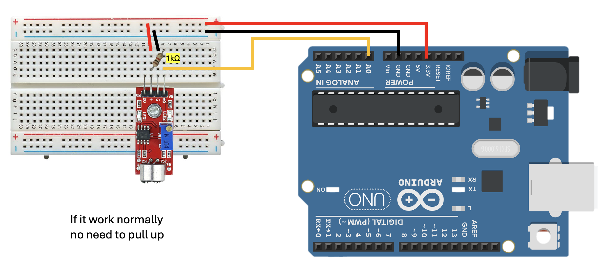
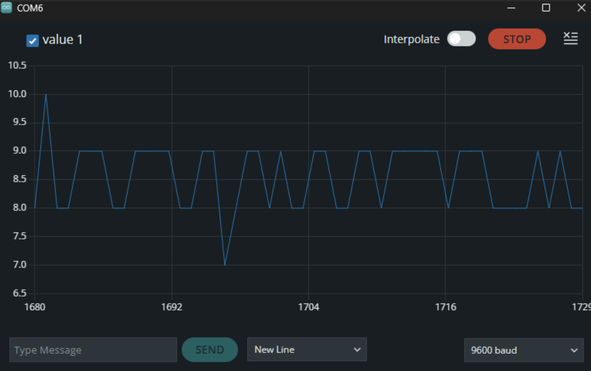

# Arduino Sound Sensor (Sound Detection Sensor) 

## Overview (ภาพรวม)
แลปนี้เป็นการทดลองใช้งาน `**Sound Sensor (เซ็นเซอร์ตรวจจับเสียง)**` แบบอนาล็อก โมดูลนี้จะรับคลื่นเสียงผ่านไมโครโฟนและแปลงเป็นระดับแรงดันไฟฟ้า 

ในแลปนี้ บอร์ด Arduino จะใช้ฟังก์ชัน `analogRead()` เพื่ออ่านค่าจากขา A0 ซึ่งจะได้ผลลัพธ์เป็นตัวเลขความละเอียด 10-bit (ช่วง `0 - 1023`) ค่าตัวเลขจะแกว่งขึ้นลงตามความดังและคลื่นความถี่ของเสียงที่เข้ามากระทบไมค์ เหมาะสำหรับนำไปประยุกต์ใช้กับสวิตช์เปิดปิดไฟด้วยเสียงตบมือ, ระบบแจ้งเตือนระดับเสียงรบกวน, หรือไฟ LED เต้นตามจังหวะเพลง

## Hardware Wiring (การต่อวงจร)
การเชื่อมต่อสายสัญญาณระหว่างโมดูล Sound Sensor และบอร์ด Arduino UNO สามารถทำได้ตามตารางนี้:

| Sound Sensor Module | Arduino UNO Board |
| :--- | :--- |
| **VCC** (หรือ +) | 5V |
| **GND** (หรือ G) | GND |
| **A0 / OUT** (Analog Output) | **A0** (Analog In) |



*(1. หมายเหตุ: โมดูลเซ็นเซอร์เสียงบางรุ่นอาจมีทั้งขา A0 และ D0 สำหรับแลปนี้ให้ต่อสายสัญญาณที่ขา **A0**)*


## Code
อัปโหลดโค้ดด้านล่างนี้ลงในบอร์ด Arduino (เปิดกราฟ scatter plot ได้โดยการกด Ctrl + Shift + L):

```cpp
int soundPin = A0; 

void setup() {
  Serial.begin(9600);
  pinMode(soundPin, INPUT);
}

void loop() {
  int sensorValue = analogRead(soundPin);
  Serial.println(sensorValue);
  delay(10);  
}
```

Output: 

