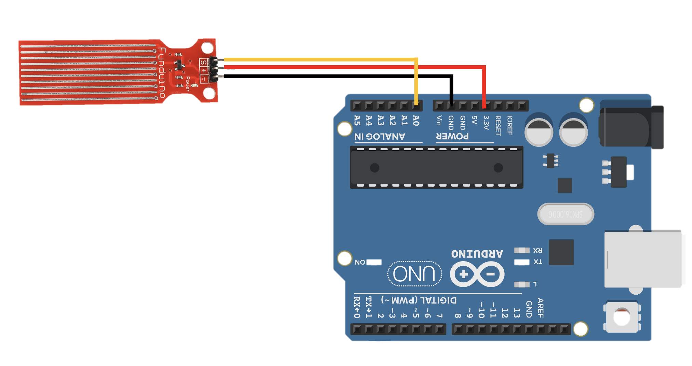

# Arduino Water Sensor (Water Level Sensor)

## Overview (ภาพรวม)
แลปเจกต์นี้เป็นการทดลองใช้งาน `**Water Sensor (เซ็นเซอร์วัดระดับน้ำ / ความชื้น)**`เซ็นเซอร์ชนิดนี้ทำงานโดยอาศัยหลักการนำไฟฟ้าของน้ำ เมื่อมีหยดน้ำหรือความชื้นมาสัมผัสกับลายวงจรบนแผ่นเซ็นเซอร์ จะทำให้ค่าความต้านทานเปลี่ยนไป 

ในแลปนี้ บอร์ด Arduino จะอ่านค่าแบบอนาล็อก (Analog Read) ผ่านขา A0 ซึ่งจะได้ค่าตั้งแต่ `0 - 1023` จากนั้นโปรแกรมจะใช้เงื่อนไข `if - else if` ในการจัดกลุ่มช่วงตัวเลข (Threshold) เพื่อประเมินสถานะของความชื้นออกเป็น 4 ระดับ ได้แก่: แห้ง, ชื้นเล็กน้อย, ชื้นมาก และเปียก เหมาะสำหรับนำไปประยุกต์ใช้กับระบบรดน้ำต้นไม้อัตโนมัติ, สัญญาณเตือนน้ำล้น, หรือระบบปัดน้ำฝนอัจฉริยะ

## Hardware Wiring (การต่อวงจร)
การเชื่อมต่อสายสัญญาณระหว่างโมดูล Water Sensor และบอร์ด Arduino UNO สามารถทำได้ตามตารางนี้:

| Water Sensor Module | Arduino UNO Board |
| :--- | :--- |
| **VCC** (หรือ +) | 5V |
| **GND** (หรือ -) | GND |
| **A0 / S** (Analog Signal) | **A0** (Analog In) |



## Code
อัปโหลดโค้ดด้านล่างนี้ลงในบอร์ด Arduino(ตั้งค่า Baud Rate ใน Serial Monitor เป็น `9600`):

```cpp
int waterPin = A0; // A0 from module to A0 from board

void setup() {
  Serial.begin(9600);
}

void loop() {
  int val = analogRead(waterPin);
  
  if (val < 10) {
    Serial.println("แห้ง");
  } 
  else if (val >= 10 && val <= 300) {
    Serial.println("ชื้นเล็กน้อย");
  } 
  else if (val > 300 && val <= 600) {
    Serial.println("ชื้นมาก");
  } 
  else {
    Serial.println("เปียก");
  }

  delay(1000); 
}
```

Output:

