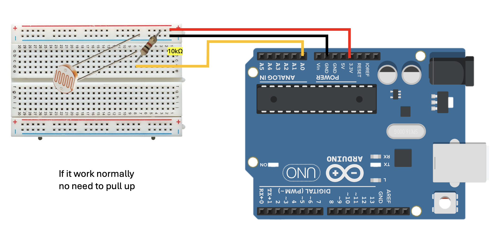
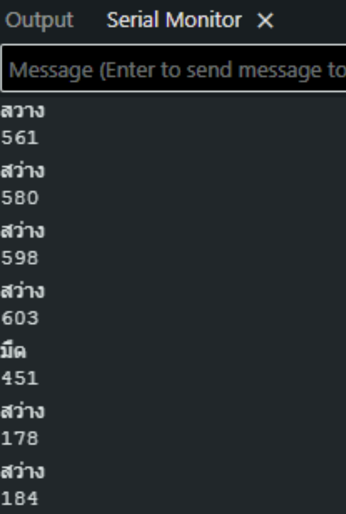

# Arduino LDR Sensor (Photoresistor) ☀️

## Overview (ภาพรวม)
แลปนี้เป็นการทดลองใช้งาน `**LDR Sensor (เซ็นเซอร์วัดแสง)**`หรือที่รู้จักกันในชื่อ Photoresistor ซึ่งเป็นตัวต้านทานที่จะเปลี่ยนค่าไปตามปริมาณแสงที่มาตกกระทบ 

ในแลปนี้ บอร์ด Arduino จะอ่านค่าอนาล็อกจากขา A0 ซึ่งจะได้ค่าตัวเลขในช่วง `0 - 1023` โดยใช้ฟังก์ชัน `analogRead()` ตามเงื่อนไขในโค้ด หากค่าที่อ่านได้สูงกว่า `600` บอร์ดจะแสดงผลว่า "มืด" แต่ถ้าน้อยกว่านั้นจะแสดงผลว่า "สว่าง" แลปนี้เป็นพื้นฐานสำหรับการนำไปประยุกต์ใช้กับระบบไฟถนนเปิด-ปิดอัตโนมัติ หรือระบบสมาร์ทโฮม

## Hardware Wiring (การต่อวงจร)
การเชื่อมต่อสายสัญญาณระหว่างโมดูล LDR Sensor และบอร์ด Arduino UNO สามารถทำได้ตามตารางนี้:

| LDR Sensor Module | Arduino UNO Board |
| :--- | :--- |
| **VCC** | 5V |
| **GND** | GND |
| **A0 / AO** (Analog Output) | **A0** (Analog In) |



## Code
อัปโหลดโค้ดด้านล่างนี้ลงในบอร์ด Arduino ของคุณ (ตั้งค่า Baud Rate ใน Serial Monitor เป็น `9600`):

```cpp
int ldrPin = A0;

void setup() {
  Serial.begin(9600);
}

void loop() {
  int val = analogRead(ldrPin);
  Serial.println(val)
  if (val > 600) {
    Serial.println("มืด");
  } else {
    Serial.println("สว่าง");
  }
  
  delay(500);
}
```

Output: 

