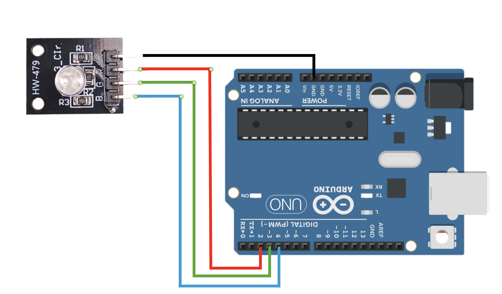
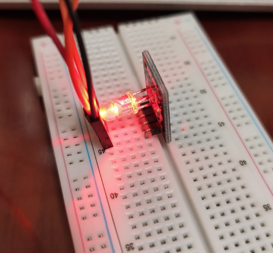
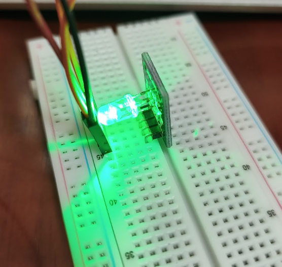
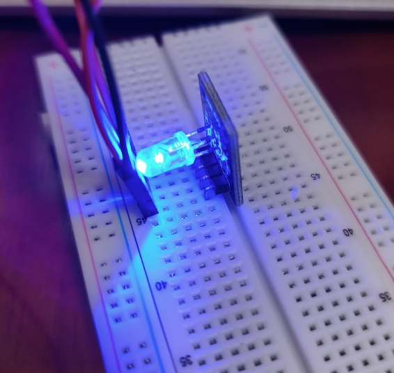

# Arduino RGB LED Module (HW-479)

## Overview (ภาพรวม)
แลปนี้เป็นการทดลองใช้งาน `**RGB LED Module (โมดูลหลอดไฟ 3 สี)**` ซึ่งประกอบไปด้วยหลอด LED สีแดง (Red), สีเขียว (Green) และสีน้ำเงิน (Blue) รวมอยู่ในหลอดเดียวกัน 

ในแลปนี้ บอร์ด Arduino จะส่งสัญญาณเพื่อควบคุมการติดดับของแต่ละสีแยกกัน ทำให้เราสามารถผสมสีออกมาเป็นสีต่างๆ ได้ตามต้องการ (คล้ายกับหลักการทำงานของพิกเซลบนหน้าจอ) เหมาะสำหรับนำไปประยุกต์ใช้ทำไฟตกแต่ง, ไฟแจ้งเตือนสถานะต่างๆ หรือระบบไฟอัจฉริยะ

## Hardware Wiring (การต่อวงจร)
การเชื่อมต่อสายสัญญาณระหว่างโมดูล RGB LED และบอร์ด Arduino UNO สามารถทำได้ตามตารางนี้:

| RGB LED Module | Arduino UNO Board |
| :--- | :--- |
| **R** (Red) | **D2** (Digital Pin 2) |
| **G** (Green) | **D3** (Digital Pin 3) |
| **B** (Blue) | **D4** (Digital Pin 4) |
| **GND** (หรือ -) | GND |



*(หมายเหตุ: โมดูล RGB บางรุ่นอาจเป็นแบบ Common Anode ซึ่งจะต้องต่อขา Common เข้ากับ 5V แทน GND และใช้วิธีสั่ง `analogWrite(pin, 0)` เพื่อให้ไฟติดแทน)*

## Code
อัปโหลดโค้ดด้านล่างนี้ลงในบอร์ด Arduino ของคุณ:

```cpp
//  R, G, B are PWM
int redPin = 2; // R from module to D2 from board
int greenPin = 3; // G from module to D2 from board
int bluePin = 4;  // B from module to D2 from board

void setup() {
  pinMode(redPin, OUTPUT);
  pinMode(greenPin, OUTPUT);
  pinMode(bluePin, OUTPUT);
}

void loop() {
  // เทสต์สีแดง
  analogWrite(redPin, 255); analogWrite(greenPin, 0); analogWrite(bluePin, 0);
  delay(1000);
  // เทสต์สีเขียว
  analogWrite(redPin, 0); analogWrite(greenPin, 255); analogWrite(bluePin, 0);
  delay(1000);
  // เทสต์สีน้ำเงิน
  analogWrite(redPin, 0); analogWrite(greenPin, 0); analogWrite(bluePin, 255);
  delay(1000);
}
```

Output: 





