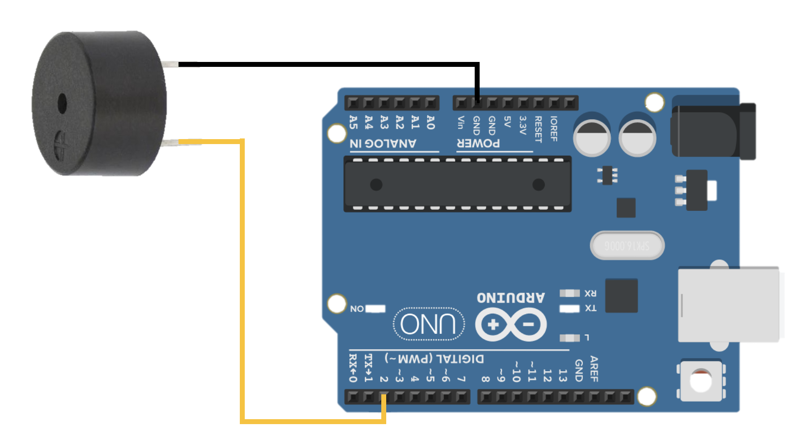

# Arduino Buzzer (Active & Passive) 🔔

## Overview (ภาพรวม)
แลปนี้เป็นการทดลองใช้งานอุปกรณ์กำเนิดเสียง (Buzzer) ซึ่งในแลปนี้เราจะพูดถึง 2 ชนิดหลักๆ ที่นิยมใช้ในงาน Arduino ได้แก่:

1. `**Active Buzzer (บัซเซอร์แบบมีวงจรขับในตัว)**` : ทำงานเหมือนสวิตช์เปิด/ปิดไฟ เพียงแค่จ่ายไฟดิจิทัล (`HIGH`) เข้าไป ก็จะส่งเสียงร้อง "บี๊ป" ออกมาเป็นโทนเดียวทันที เหมาะสำหรับทำระบบเสียงเตือนทั่วไป (Alarm)
2. `**Passive Buzzer (บัซเซอร์แบบไม่มีวงจรขับในตัว)` : ทำงานคล้ายลำโพงขนาดเล็ก ต้องอาศัยการป้อนความถี่ (Frequency) เข้าไปเพื่อให้เกิดเสียงตามต้องการ จึงสามารถสร้างเป็นเสียงดนตรี เมโลดี้ หรือตัวโน้ตต่างๆ ได้ (ผ่านคำสั่ง `tone()`)

## Hardware Wiring (การต่อวงจร)
การเชื่อมต่อสายสัญญาณของ Buzzer ทั้งสองชนิดกับบอร์ด Arduino UNO ใช้หลักการเดียวกัน (ระวังขั้วบวก/ลบ):

| Buzzer Module (Active / Passive) | Arduino UNO Board |
| :--- | :--- |
| **+** (หรือ VCC / ขาที่ยาวกว่า) | **D2** (Digital Pin 2) |
| **-** (หรือ GND / ขาที่สั้นกว่า) | GND |



## Code 1: Active Buzzer (ส่งเสียงเตือนปกติ)
อัปโหลดโค้ดด้านล่างนี้ หากโมดูลของคุณคือ **Active Buzzer** (สั่งงานด้วย `digitalWrite`):

```cpp
// ActiveBuzzer.ino
int buzzerPin = 2; // + from module to D2 from board

void setup() {
  pinMode(buzzerPin, OUTPUT);
}

void loop() {
  // Make Noise (HIGH)
  digitalWrite(buzzerPin, HIGH); 
  delay(1000); 
  
  // Silence (LOW)
  digitalWrite(buzzerPin, LOW);  
  delay(1000);
}

```

## Code 2: Passive Buzzer (สร้างเสียงดนตรี)
อัปโหลดโค้ดด้านล่างนี้ หากโมดูลของคุณคือ **Passive Buzzer** เพื่อทดลองไล่สเกลเสียง (โด เร มี):
```cpp
// PassiveBuzzer.ino
int buzzerPin = 2; // + from module to D2 from board

void setup() {
  // No need to declare pinMode because the tone() is automatically handled
}

void loop() {
  // tone(pin, Hz)
  tone(buzzerPin, 262); // Do (C4)
  delay(500);
  
  tone(buzzerPin, 294); // Re (D4)
  delay(500);
  
  tone(buzzerPin, 330); // Mi (E4)
  delay(500);
  
  // Silence
  noTone(buzzerPin);   
  delay(1000);
}
```
