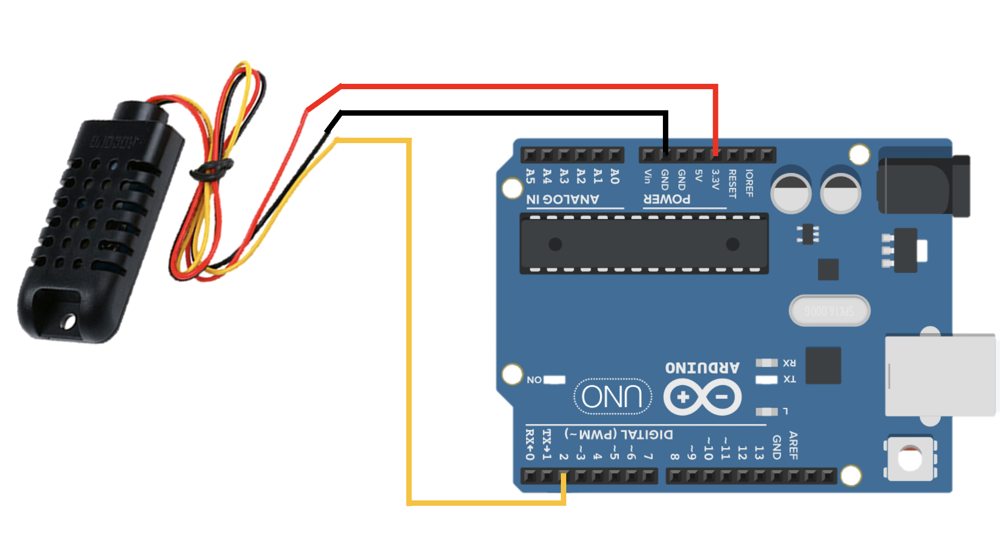
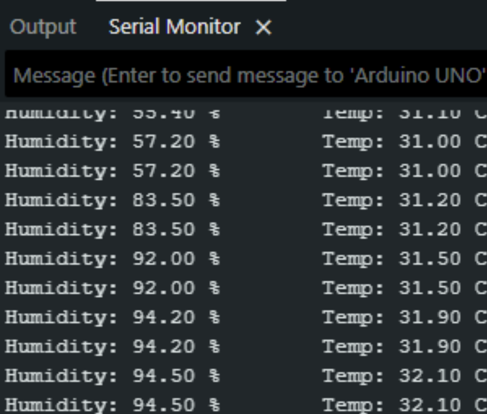

# Arduino Temperature & Humidity Sensor (DHT21)

## Overview (ภาพรวม)
แลปนี้เป็นการทดลองใช้งาน `**DHT21 (เซ็นเซอร์วัดอุณหภูมิและความชื้น)**` ซึ่งเป็นเซ็นเซอร์ที่ให้ค่าความแม่นยำสูงกว่ารุ่น DHT11 เล็กน้อย ตัวโมดูลจะส่งข้อมูลทั้งอุณหภูมิ (องศาเซลเซียส) และความชื้นสัมพัทธ์ (เปอร์เซ็นต์) ออกมาทางสายสัญญาณเพียงเส้นเดียว (Single-bus)

ในแลปนี้ บอร์ด Arduino จะต้องอาศัยชุดคำสั่งพิเศษ (Library) ในการถอดรหัสสัญญาณที่เซ็นเซอร์ส่งมา แลปนี้เป็นจุดเริ่มต้นที่สมบูรณ์แบบสำหรับการนำไปทำระบบ Smart Farm, สถานีตรวจวัดอากาศขนาดเล็ก (Weather Station) หรือระบบเปิด-ปิดพัดลมอัตโนมัติ

## Prerequisites (ข้อกำหนดเบื้องต้น)
ก่อนอัปโหลดโค้ด คุณ**ต้อง**ติดตั้งไลบรารี 2 ตัวนี้ผ่าน **Library Manager** ใน Arduino IDE ก่อน:
1. `DHT sensor library` (โดย Adafruit)
2. `Adafruit Unified Sensor`

## Hardware Wiring (การต่อวงจร)
การเชื่อมต่อสายสัญญาณระหว่างโมดูล DHT21 และบอร์ด Arduino UNO สามารถทำได้ตามตารางนี้:

| DHT21 Sensor Module | Arduino UNO Board |
| :--- | :--- |
| **VCC / +** (ไฟเลี้ยง) | 5V (หรือ 3.3V) |
| **GND / -** (กราวด์) | GND |
| **DATA / OUT** (สายสัญญาณ) | **D2** (Digital Pin 2) |



## Code
อัปโหลดโค้ดด้านล่างนี้ลงในบอร์ด Arduino ของคุณ (ตั้งค่า Baud Rate ใน Serial Monitor เป็น `9600`):

```cpp
// Download Library: "DHT sensor library" และ "Adafruit Unified Sensor" จาก Library Manager
#include "DHT.h"
#define DHTPIN 2       // Data Wire to D2
#define DHTTYPE DHT21  // Config Model (DHT21)

DHT dht(DHTPIN, DHTTYPE);

void setup() {
  Serial.begin(9600);
  dht.begin();
}

void loop() {
  float h = dht.readHumidity();
  float t = dht.readTemperature();
  
  Serial.print("Humidity: "); 
  Serial.print(h);
  Serial.print(" % \t Temp: "); 
  Serial.print(t); 
  Serial.println(" C");
  
  delay(1000); // หน่วงเวลา 1 วินาที
}
```

Output : 


