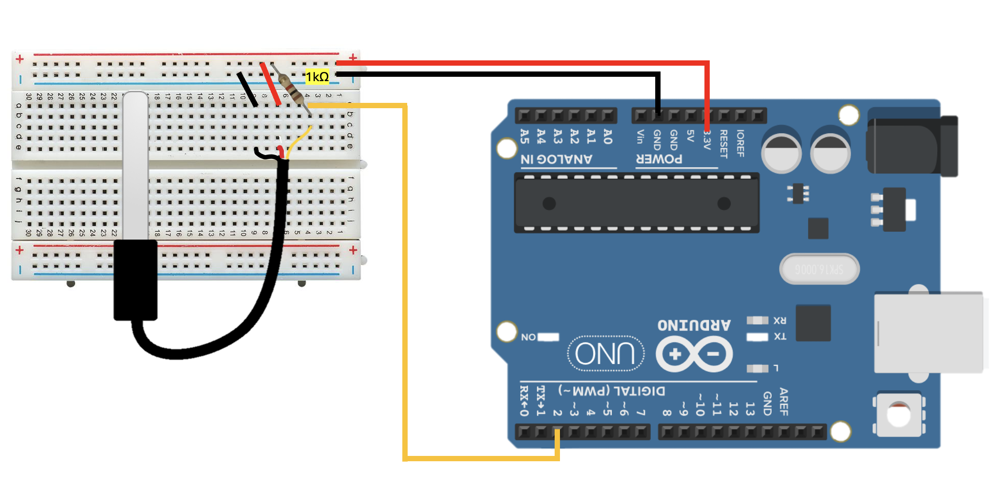
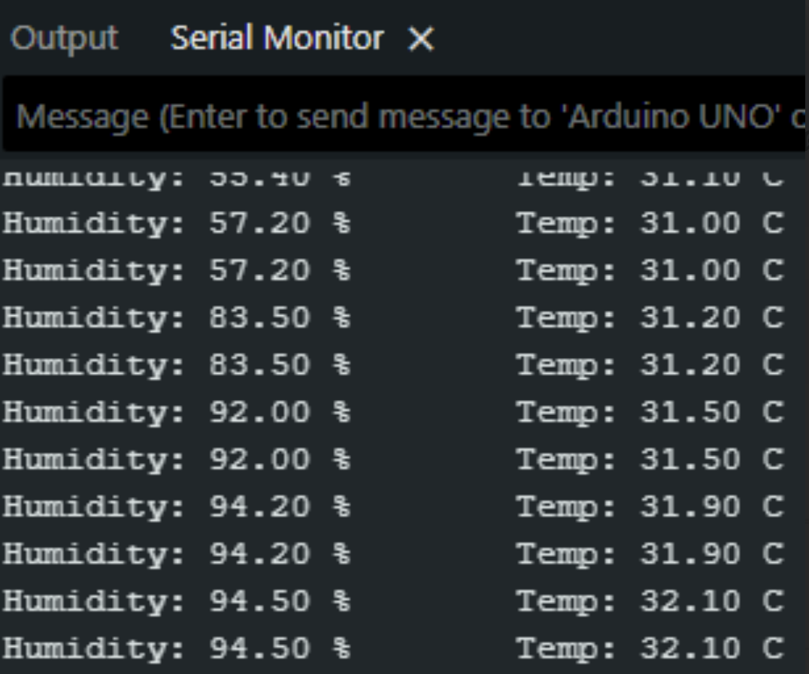

# Arduino Water Temperature Sensor (DS18B20)

## Overview (ภาพรวม)
แลปนี้เป็นการทดลองใช้งาน `**DS18B20 (เซ็นเซอร์วัดอุณหภูมิแบบกันน้ำ)**` เซ็นเซอร์ตัวนี้มักมาในรูปแบบหัวโพรบสแตนเลสที่ซีลกันน้ำ ทำให้เหมาะมากสำหรับการวัดอุณหภูมิของเหลว อุณหภูมิดิน หรือในสภาพแวดล้อมที่เปียกชื้น 

ในแลปนี้ บอร์ด Arduino จะสื่อสารกับเซ็นเซอร์ผ่านโปรโตคอล 1-Wire ซึ่งเป็นระบบบัสที่ใช้สายสัญญาณข้อมูลเพียงเส้นเดียวแต่สามารถต่อเซ็นเซอร์พ่วงกันได้หลายตัว แลปนี้นิยมนำไปประยุกต์ใช้ในตู้ปลาอัจฉริยะ, ระบบปลูกผักไฮโดรโปนิกส์, 

## ⚙️ ข้อกำหนดเบื้องต้น (Prerequisites)
ก่อนอัปโหลดโค้ด คุณ**ต้อง**ติดตั้งไลบรารี 2 ตัวนี้ผ่าน **Library Manager** ใน Arduino IDE ก่อน:
1. `OneWire` (สำหรับการสื่อสารผ่านสายเส้นเดียว)
2. `DallasTemperature` (สำหรับการอ่านค่าอุณหภูมิจาก DS18B20)

## Hardware Wiring (การต่อวงจร)
การเชื่อมต่อสายสัญญาณของ DS18B20 แบบหัวโพรบ (สาย 3 สี) เข้ากับบอร์ด Arduino UNO ทำได้ตามตารางนี้:

| DS18B20 Sensor | Arduino UNO Board |
| :--- | :--- |
| **VCC** (สายสีแดง) | 5V |
| **GND** (สายสีดำ) | GND |
| **DATA** (สายสีเหลือง) | **D2** (Digital Pin 2) |



*(⚠️ **สำคัญมาก:** สำหรับเซ็นเซอร์ที่นี้จำเป็นทำ Pull-up สัญญาณ ไม่เช่นนั้นเซ็นเซอร์จะอ่านค่าไม่ได้ แต่ถ้าคุณใช้แบบที่เป็นโมดูลวงจรสำเร็จรูป มักจะมีตัวต้านทานนี้ฝังมาให้แล้ว)*

## Code
อัปโหลดโค้ดด้านล่างนี้ลงในบอร์ด Arduino ของคุณ (ตั้งค่า Baud Rate ใน Serial Monitor เป็น `9600`):

```cpp
// Download Library: OneWire, DallasTemperature From Library Manager
#include <OneWire.h>
#include <DallasTemperature.h>

#define ONE_WIRE_BUS 2 // ต่อขา Data สีเหลือง เข้า Pin 2
OneWire oneWire(ONE_WIRE_BUS);
DallasTemperature sensors(&oneWire);

void setup() {
  Serial.begin(9600);
  sensors.begin();
}

void loop() {
  sensors.requestTemperatures(); // สั่งให้เซ็นเซอร์เตรียมอ่านค่าอุณหภูมิ
  float tempC = sensors.getTempCByIndex(0); // ดึงค่าอุณหภูมิตัวที่ 0 (ตัวแรก)
  
  Serial.print("Water Temp: ");
  Serial.print(tempC);
  Serial.println(" C");
  
  delay(1000); // หน่วงเวลา 1 วินาที
}
```
Output : 

