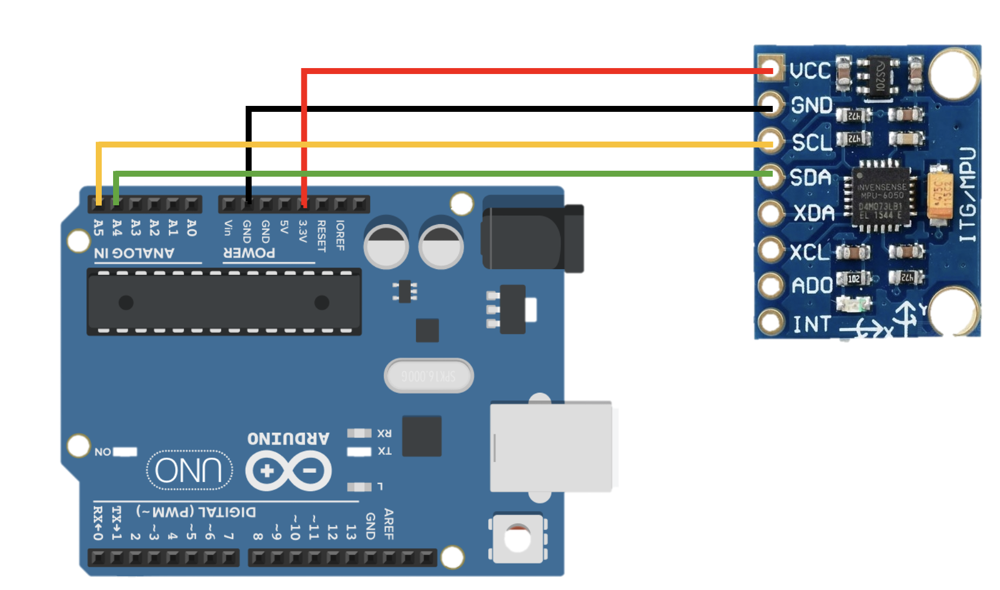

# Arduino Accelerometer & Gyroscope (MPU-6050)

## Overview (ภาพรวม)
แลปนี้เป็นการทดลองใช้งาน `**MPU-6050 (เซ็นเซอร์วัดความเร่งและไจโรสโคป)**` เพื่อสร้างระบบตรวจจับทิศทางการเอียงอย่างง่าย (Tilt Direction Detection) 

ในแลปนี้ บอร์ด Arduino จะอ่านค่าความเร่งดิบในแนวแกน X, Y และ Z จากเซ็นเซอร์ผ่านโปรโตคอล I2C จากนั้นนำมาเข้าสูตรคณิตศาสตร์ (ฟังก์ชันตรีโกณมิติ `atan2`) เพื่อแปลงเป็นมุมองศาการเอียง 2 แกน ได้แก่ **Roll (การเอียงซ้าย-ขวา)** และ **Pitch (การเอียงหน้า-หลัง)** โดยโค้ดจะมีการกำหนดค่า Threshold ไว้ที่ 15 องศา หากเซ็นเซอร์เอียงเกินองศานี้ ระบบจะแสดงผลทิศทางออกมาทาง Serial Monitor (เช่น เอียงซ้าย, เอียงขวา, เอียงขึ้น, เอียงลง หรือ สมดุล) แลปนี้นำไปประยุกต์ใช้สร้างคอนโทรลเลอร์ควบคุมรถบังคับ

## Hardware Wiring (การต่อวงจร)
การเชื่อมต่อสายสัญญาณ I2C ระหว่างโมดูล MPU-6050 และบอร์ด Arduino UNO สามารถทำได้ตามตารางนี้:

| MPU-6050 Module | Arduino UNO Board |
| :--- | :--- |
| **VCC** | 5V (โมดูลส่วนใหญ่มี Regulator รับ 5V ได้) |
| **GND** | GND |
| **SCL** (Clock) | **A5** (หรือขา SCL มุมขวาบนของบอร์ด) |
| **SDA** (Data) | **A4** (หรือขา SDA มุมขวาบนของบอร์ด) |



*(หมายเหตุ: ขา AD0 และ INT ในแลปนี้ปล่อยว่างไว้ได้เลย ไม่ต้องต่อ)*

## Code
อัปโหลดโค้ดด้านล่างนี้ลงในบอร์ด Arduino ของคุณ (ตั้งค่า Baud Rate ใน Serial Monitor เป็น `9600`):

```cpp
#include <Wire.h>
#include <math.h>

const int MPU_addr = 0x68;

// Set Offset (Calibration)
float roll_offset = 0.0;   

// Variables for Low-Pass Filter
float filtered_roll = 0;
const float alpha = 0.15; // Adjust smoothness (lower value = smoother)

void setup() {
  Wire.begin();
  Wire.beginTransmission(MPU_addr);
  Wire.write(0x6B); // Wake up MPU
  Wire.write(0);
  Wire.endTransmission(true);
  Serial.begin(9600);
}

void loop() {
Wire.beginTransmission(MPU_addr);
  Wire.write(0x3B);
  Wire.endTransmission(false);
  
  // ขออ่านข้อมูล 6 ไบต์ต่อเนื่อง (X, Y, Z แกนละ 2 ไบต์)
  Wire.requestFrom(MPU_addr, 6, true); 
  
  // อ่านค่ามาทีละแกน (นำไบต์สูงมาต่อกับไบต์ต่ำ) แล้วหารด้วย 16384.0 เพื่อแปลงเป็นสเกล g
  float AcX = (Wire.read() << 8 | Wire.read()) / 16384.0; 
  float AcY = (Wire.read() << 8 | Wire.read()) / 16384.0; 
  float AcZ = (Wire.read() << 8 | Wire.read()) / 16384.0; 

  Serial.print("X: "); 
  Serial.print(AcX); 
  Serial.print(" | Y: "); 
  Serial.print(AcY); 
  Serial.print(" | Z: "); 
  Serial.println(AcZ); 

  delay(100); 
}
```

Output : 


