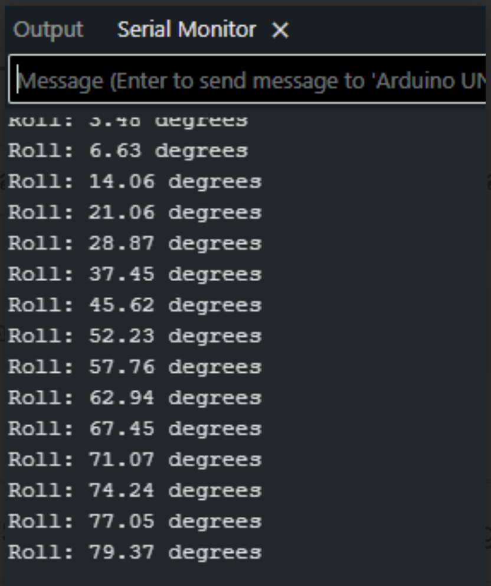

# Arduino Accelerometer & Gyroscope (MPU-6050)

## Overview (ภาพรวม)
แลปนี้เป็นการทดลองใช้งาน `**MPU-6050 (เซ็นเซอร์วัดความเร่งและไจโรสโคป)**` แบบ 6 แกน (6-Axis IMU) ซึ่งเป็นเซ็นเซอร์ที่ใช้ตรวจจับการเคลื่อนไหว การเอียง และทิศทาง โดยสื่อสารกับบอร์ด Arduino ผ่านโปรโตคอล I2C

ในแลปนี้ เราไม่ได้ใช้ไลบรารีสำเร็จรูป แต่จะเป็นการเขียนโค้ดอ่านค่าดิบ (Raw Data) จากรีจิสเตอร์ของเซ็นเซอร์โดยตรง โค้ดนี้จะดึงเฉพาะค่าความเร่งแกน Y และ Z มาคำนวณด้วยฟังก์ชันตรีโกณมิติ (`atan2`) เพื่อหา "องศาการเอียงแกน X (Roll Angle)" และจุดเด่นของแลปนี้คือการประยุกต์ใช้สมการ **Low-Pass Filter** เพื่อช่วยกรองสัญญาณรบกวน ทำให้ได้ค่าองศาที่ราบรื่นและนิ่งมากขึ้น เหมาะสำหรับนำไปต่อยอดทำหุ่นยนต์เดินสองขา (Balancing Robot), โดรน, หรือจอยสติ๊กตรวจจับการเคลื่อนไหว

## Hardware Wiring (การต่อวงจร)
การเชื่อมต่อสายสัญญาณ I2C ระหว่างโมดูล MPU-6050 และบอร์ด Arduino UNO สามารถทำได้ตามตารางนี้:

| MPU-6050 Module | Arduino UNO Board |
| :--- | :--- |
| **VCC** | 5V (โมดูลส่วนใหญ่มี Regulator รับ 5V ได้) |
| **GND** | GND |
| **SCL** (Clock) | **A5** (หรือขา SCL มุมขวาบนของบอร์ด) |
| **SDA** (Data) | **A4** (หรือขา SDA มุมขวาบนของบอร์ด) |


*(หมายเหตุ: ขา AD0 และ INT ในแลปนี้ปล่อยว่างไว้ได้เลย ไม่ต้องต่อ)*

## Code
อัปโหลดโค้ดด้านล่างนี้ลงในบอร์ด Arduino ของคุณ (ตั้งค่า Baud Rate ใน Serial Monitor เป็น `9600`):

```cpp
#include <Wire.h>
#include <math.h>

const int MPU_addr = 0x68;

// Set Offset (Calibration)
float roll_offset = 0.0;   

// Variables for Low-Pass Filter
float filtered_roll = 0;
const float alpha = 0.15; // Adjust smoothness (lower value = smoother)

void setup() {
  Wire.begin();
  Wire.beginTransmission(MPU_addr);
  Wire.write(0x6B); // Wake up MPU
  Wire.write(0);
  Wire.endTransmission(true);
  Serial.begin(9600);
}

void loop() {
  Wire.beginTransmission(MPU_addr);
  Wire.write(0x3B); // Start at the first Data Register
  Wire.endTransmission(false);
  
  // Read 6 bytes in sequence (X, Y, Z, 2 bytes each)
  Wire.requestFrom(MPU_addr, 6, true); 
  
  // Skip X-axis (read and discard 2 bytes)
  Wire.read(); 
  Wire.read(); 
  
  // Read Y and Z axis values and divide by 16384.0 to convert to g-scale
  float AcY = (Wire.read() << 8 | Wire.read()) / 16384.0; 
  float AcZ = (Wire.read() << 8 | Wire.read()) / 16384.0; 

  // Calculate raw roll in degrees (-180 to 180)
  float raw_roll = atan2(AcY, AcZ) * 180.0 / PI;

  // Apply calibration offset
  raw_roll += roll_offset;

  // Apply Low-Pass Filter to smooth the signal
  filtered_roll = (alpha * raw_roll) + ((1.0 - alpha) * filtered_roll);
  
  Serial.print("Roll: "); 
  Serial.print(filtered_roll); 
  Serial.println(" degrees"); 

  delay(100); 
}
```

Output : 

