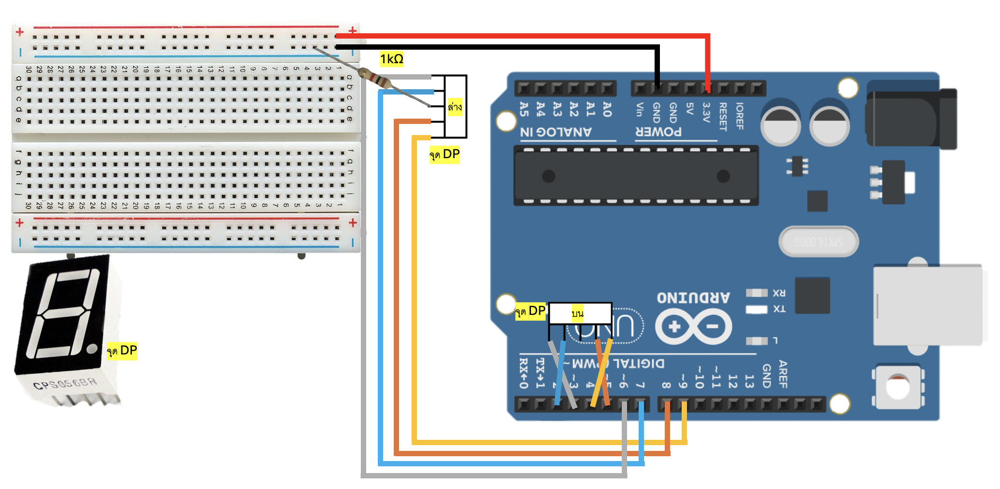
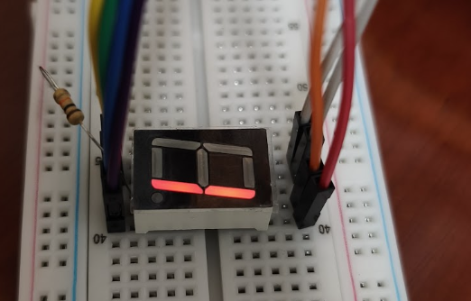
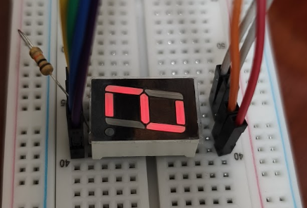
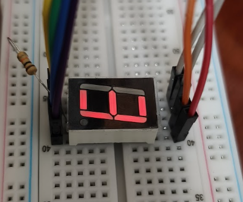

# Arduino 7-Segment Display 

## Overview (ภาพรวม)
แลปนี้เป็นการทดลองใช้งาน `**7-Segment Display (จอแสดงผลตัวเลข 7 ส่วน)**` ซึ่งเป็นอุปกรณ์คลาสสิกที่ประกอบด้วยหลอด LED ย่อยๆ 7 ดวง (เรียกว่าส่วน a, b, c, d, e, f, g) จัดเรียงกันเป็นรูปเลข 8 เพื่อใช้แสดงผลตัวเลข

ในแลปนี้ เราจะใช้จอแบบ **Common Cathode (ขาร่วมขั้วลบ)** บอร์ด Arduino จะส่งสัญญาณ `HIGH` (1) ไปยังขาต่างๆ เพื่อสั่งให้หลอดไฟสว่างตามรูปแบบของตัวเลข 0 ถึง 9 จุดเด่นของโค้ดนี้คือการใช้ "เลขฐานสอง (Binary)" ในการเก็บรูปแบบ (Pattern) ของหลอดไฟแต่ละดวงไว้ใน Array แล้วดึงค่าออกมาแสดงผลวนลูปไปเรื่อยๆ เหมาะสำหรับนำไปประยุกต์ทำนาฬิกาดิจิทัล

## Hardware Wiring (การต่อวงจร)
การเชื่อมต่อสายสัญญาณระหว่างจอ 7-Segment และบอร์ด Arduino UNO สามารถทำได้ตามตารางนี้ (อ้างอิงตามลำดับขาในโค้ด):

| 7-Segment Pin | Arduino UNO Board |
| :--- | :--- |
| **a** (บนสุด) | **D2** |
| **b** (ขวาบน) | **D3** |
| **c** (ขวาล่าง) | **D8** |
| **d** (ล่างสุด) | **D7** |
| **e** (ซ้ายล่าง) | **D6** |
| **f** (ซ้ายบน) | **D5** |
| **g** (ตรงกลาง) | **D4** |
| **COM** (Common) | **GND** |



*(⚠️ **ข้อควรระวัง:** ควรต่อตัวต้านทาน (Resistor) อนุกรมไว้ที่ขา COM ก่อนต่อลง GND เพื่อป้องกันไม่ให้หลอด LED ขาดเนื่องจากกระแสไฟเกิน)*

## Code
อัปโหลดโค้ดด้านล่างนี้ลงในบอร์ด Arduino ของคุณ:

```cpp
// ลำดับขาที่ต่อ: a, b, c, d, e, f, g
int segments[] = {2, 3, 8, 7, 6, 5, 4}; 

// รูปแบบเลข 0-9 สำหรับ Common Cathode
byte data[10] = {
  0b00111111, // 0
  0b00000110, // 1
  0b01011011, // 2
  0b01001111, // 3
  0b01100110, // 4
  0b01101101, // 5
  0b01111101, // 6
  0b00000111, // 7
  0b01111111, // 8
  0b01101111  // 9
};

void setup() {
  for (int i = 0; i < 7; i++) {
    pinMode(segments[i], OUTPUT);
  }
}

void loop() {
  for (int i = 0; i < 10; i++) {
    showDigit(i);
    delay(1000); // หน่วงเวลา 1 วินาทีเปลี่ยนเลข
  }
}

void showDigit(int n) {
  for (int i = 0; i < 7; i++) {
    // ใช้ bitRead เพื่ออ่านค่าแต่ละบิตจากขวาไปซ้าย (เริ่มจาก a)
    digitalWrite(segments[i], bitRead(data[n], i));
  }
}
```

Output : 





